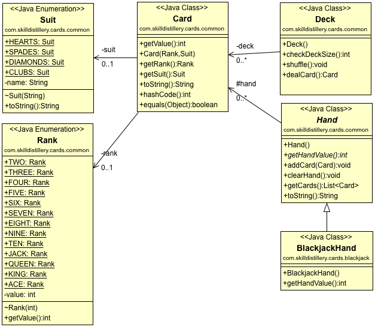

## Blackjack

### My Skill Distillery Week Three Blackjack Project

How to run this program:

1. Download all the files in the folder called "src/com/skilldistillery/blackjack/" that end with .java
2. Start a terminal (shell)
3. Compile all the .java files using the Java 8 compiler (ie Java 1.8, javac filename.java)
4. Run in the terminal with "java com.skilldistillery.jets.JetsApplication"
5. After that it should be pretty self explanatory

Here is what the overall architecture of the program looks like in UML:

My Learning Objectives

-Getting comfortable building classes in an Object-Oriented manner.
-Building classes whose fields are Objects.
-Practice writing methods.
-Use collection types to organize and manage data.
-Use conditionals to create game logic.

Thanks,

             ____                      _             
            |  _ \                    | |            
            | |_) |_ __ __ _ _ __   __| | ___  _ __  
            |  _ <| '__/ _` | '_ \ / _` |/ _ \| '_ \ 
            | |_) | | | (_| | | | | (_| | (_) | | | |
            |____/|_|  \__,_|_| |_|\__,_|\___/|_| |_|
                                                     
                                                     

