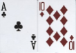

# Blackjack &nbsp;&nbsp;&nbsp;&nbsp;&nbsp;&nbsp;  #

## Blackjack Project, Week Three, Skill Distillery ##

### How to Run this Program ###

1. Download all the files in the folder called "src/com/skilldistillery/blackjack/" that end with .java
2. Start a terminal (shell)
3. Compile all the .java files using the Java 8 compiler (ie Java 1.8, javac filename.java)
4. Run in the terminal with "java com.skilldistillery.blackjack.Blackjack"
5. After that it should be pretty self explanatory

### Technologies Used ###

* Java object-oriented classes
* Java classes whose fields are objects
* Java methods
* Used collection types to organize and manage data
* Used conditionals to create game logic
* Eclipse
* The debug perspective and tools in Eclipse
* Terminal
* Git
* GitHub

### General Blackjack Play ###

* When the game begins both the player and dealer are dealt two cards but the dealer's first card is face down.
* If a player or dealer is dealt 21 the game is over. Otherwise the player can choose to hit as many times as they wish until they choose to stay.
* Once the player has completed their turn the dealer will begin their turn, automatically hitting or staying according to the Blackjack rules.
* The game is immediately over if either player gets above 21.
* The winner is the one with more points (below 21).
* Overview from Wikipedia: [https://en.wikipedia.org/wiki/Blackjack]

### Card Values ###

Card values are as follows:
* Number cards have the value that corresponds to their number
* Face cards are all worth 10
* Ace is worth 11 unless you go over 21; then it is worth 1

### How this Game Works ###

* Enter "p" to play (then hit Enter).
* The game will hide the dealer's first card and show you the dealer's second card.
* Then it will show you both of your cards.
* Now you have a choice. Would you like to hit (get another card delt to you) or stay (you like your hand the way it is)? Enter "h" to hit (then hit Enter) and "s" to stay (then hit Enter).
* Once you are happy with your hand (if you have not already busted), you choose to stay and then the dealer will go through his hand. The dealer will always play out his hand just to show you his cards.
* After the dealer has played you will see who won that round and be prompted to play again.

###  

<!--- 
How to run. - Done
What it does. - 
List the technologies you used.
Explain how it went for me.
 --->

Thanks,

             ____                      _             
            |  _ \                    | |            
            | |_) |_ __ __ _ _ __   __| | ___  _ __  
            |  _ <| '__/ _` | '_ \ / _` |/ _ \| '_ \ 
            | |_) | | | (_| | | | | (_| | (_) | | | |
            |____/|_|  \__,_|_| |_|\__,_|\___/|_| |_|
                                                     
                                                     

